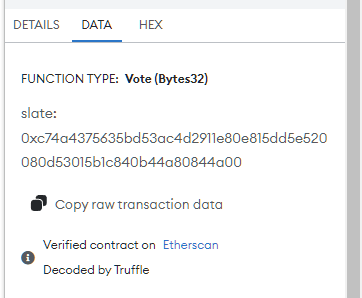
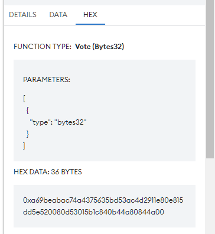
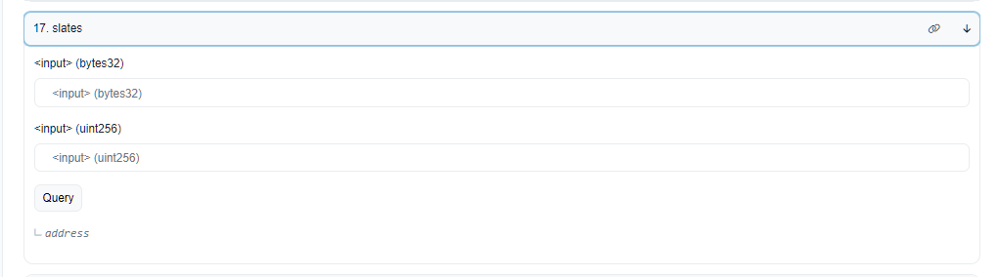
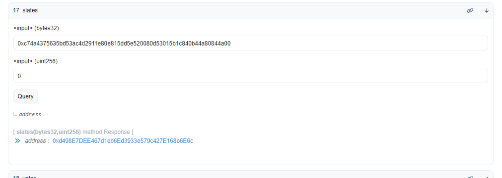
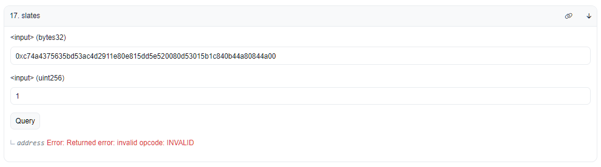
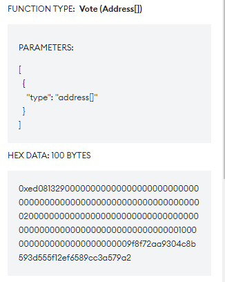

# Executive Transaction Verification

The transaction that you sign when voting on an executive proposal should use one of the following methods. 

## Method A - Vote(bytes32)

This method is the most common and is almost always what you'll see when interacting with a voting front-end.

This method takes a single parameter, a bytes32 representing a _slate_. 

| Prefix | Method   | Data                                                                |
|--------|----------|---------------------------------------------------------------------|
| 0x     | a69beaba | 64 character hexadecimal slate                                      |
| 0x     | a69beaba | c74a4375635bd53ac4d2911e80e815dd5e520080d53015b1c840b44a80844a00    |

### Step 1 - Finding the Slate

The first step here is locating the _slate_. A _slate_ represents a collection of addresses (almost always executive spell contracts) that are voted for as a group. This grouping of voted addresses is a consequence of the executive voting system and its support for approval voting. Slates are also used to represent single addresses within the Maker Protocol governance contract.

Using metamask, check the data and hex tabs:

## Step 2 - Checking the Slate

Once you have located the 64-character hexadecimal string that represents the slate, you should check it against the contents of the slate in the [DSChief](https://etherscan.io/address/0x0a3f6849f78076aefadf113f5bed87720274ddc0#readContract) contract.

Using etherscan, you can navigate to read-method 17, 'slates'. There are two input fields.
1. For the first field you should enter the slate address you identified in step 1. You should prefix the string with 0x.
2. The the second field you should first enter 0.

In the below example, the spell address we intended to vote for is: **0xd498E7DEE467d1eb6Ed3933e579c427E168b6E6c**.

Etherscan should display a spell address that matches the spell address of the proposal which you have selected using the Voting Portal UI.

Next, you should increment the second input field and query until you see an error message.

**You are voting in favor of all addresses that appear prior to this error message being given permission over the core Maker Protocol contracts.**

## Method B - Vote(address[])

This method is used more rarely, usually only when you are the first person to vote on a new address or set of addresses.

The structure of the transaction data is a little more variable than for method A. However it should:
* Start with **0xed081329**
* Contain one or more Ethereum addresses separated by strings of zeros.

### Step 1 - Check Addresses

The first and only step here is to check that addresses present in the transaction data match the addresses that you intend to vote for.

In the below example the spell address used is: **0x9f8f72aa9304c8b593d555f12ef6589cc3a579a2**.

Using metamask, check the data and hex tabs:

**You are voting in favor of all addresses that appear in this transaction data being given permission over the core Maker Protocol contracts.**

