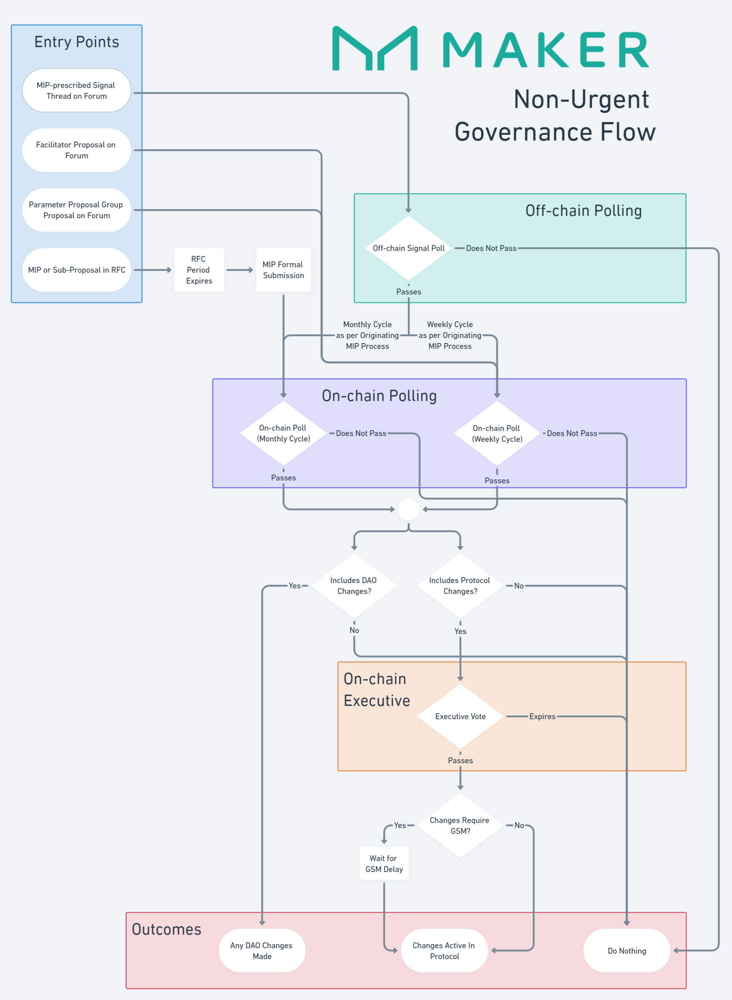

# Governance Flow 

## References

* [Signal Threads](off-chain-governance.md#forum-signal-threads)
* [Maker Improvement Proposals](mips.md)
* [MIP6 Applications](https://mips.makerdao.com/mips/details/MIP6)
* [On-Chain Polling](on-chain-governance.md#governance-polls)
* [On-Chain Executive](on-chain-governance.md#executive-votes)
* [GSM Delay](../parameter-index/core/param-gsm-pause-delay.md)

$eof1$
$eof2$
$eof3$
$eof4$