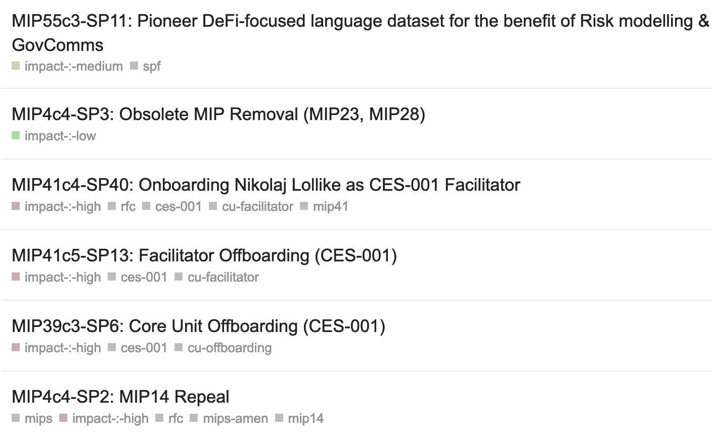
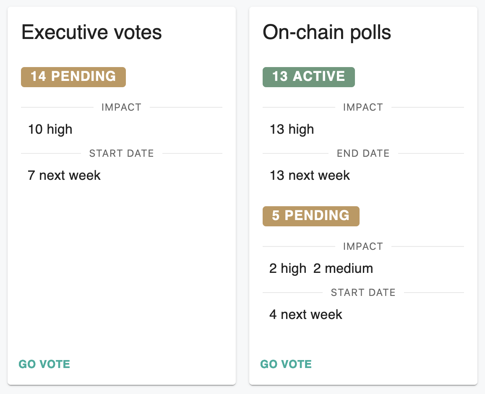

# Impact Estimations

The Governance Facilitators apply impact estimations to active governance items (e.g. Scope amendments and risk parameter changes). The goal of these estimations is to provide Alignment Conservers and the wider community with an idea of how important it is that they pay attention to a given governance item given limited time.

Impact estimations currently have a single dimension, giving the Governance Facilitator's estimate on the magnitude of the impact a given governance item could have on the Maker Protocol and MakerDAO. A `low`, `medium`, or `high` impact score is assigned to active governance items.

## Guidelines

The following guidelines are used when creating estimations.

**Likely High Impact**
* Anything that adds or removes concretely identifiable risk to the Maker Protocol are likely to be marked as `high` impact.
* Anything the DAO is doing for the first time is likely to be marked as `high` impact.
* Anything that adds or removes a non-trivial amount of DAI from the surplus buffer are likely to be marked as `high` impact.
* Core Unit onboarding and offboarding are likely to be marked as `high` impact.
* Anything that permanently changes governance processes or structures within MakerDAO are likely to be marked as `high` impact.

**Likely Medium Impact**
* Items that may lead to later decisions that add or remove risk and/or add or remove a non-trivial amount of DAI from the surplus buffer are likely to be marked as `medium` impact.
* Anything that adds or removes a trivial amount of money from the surplus buffer are likely to be marked as `medium` impact.

**Likely Low Impact**
* Minor wording changes and/or fixes to existing MIPs are likely to be marked as `low` impact.

If there is any doubt about a given estimation, it is generally rounded up.

## Usage

[Governance tracker spreadsheet](https://docs.google.com/spreadsheets/d/1LWNlv6hr8oXebk8rvXZBPRVDjN-3OrzI0IgLwBVk0vM/edit#gid=0)   

[Forum](https://forum.makerdao.com/) posts for RFC MIPs and Signal Requests   

[Voting portal](https://vote.makerdao.com)   

[Governance Dashboard](https://governance-metrics-dashboard.vercel.app/tracker)   

## Disclaimer

These estimates should be used as a guide and not as a source of truth. Community members remain responsible for any actions they take on the basis of these estimates.

>Page last reviewed: 2023-02-27  
>Next review due: 2023-08-27   