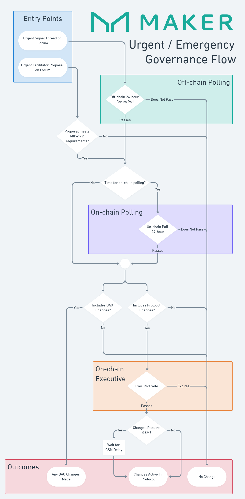

# Urgent Governance Flow

## References

* [Signal Threads](off-chain-governance.md#forum-signal-threads)
* [MIP41c2: Facilitator Governance Powers](https://mips.makerdao.com/mips/details/MIP41#MIP41c2)
* [On-Chain Polling](on-chain-governance.md#governance-polls)
* [On-Chain Executive](on-chain-governance.md#executive-votes)
* [GSM Delay](../parameter-index/core/param-gsm-pause-delay.md)